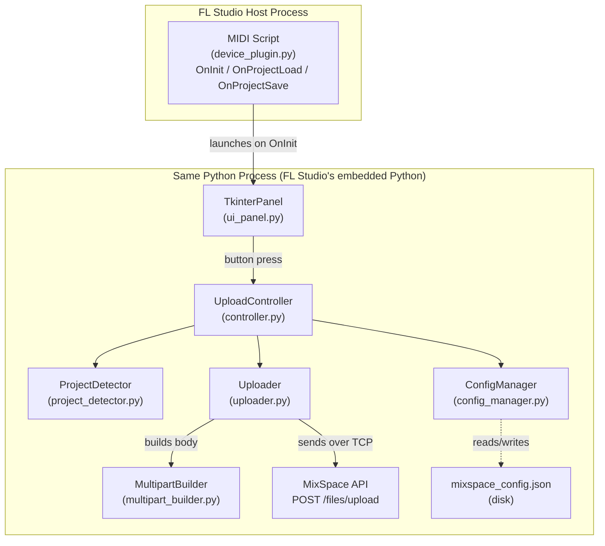
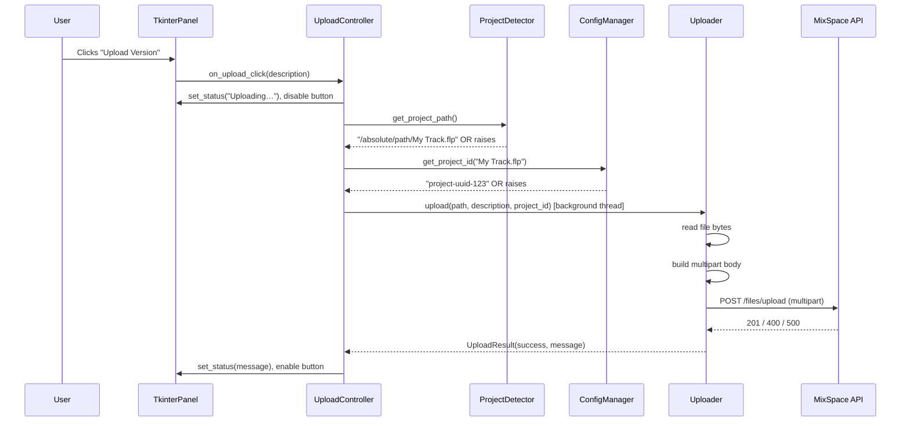

# Design Document — FL Studio MixSpace Plugin

## Overview

The FL Studio MixSpace Plugin is a pure-Python MIDI Script Device that surfaces a floating tkinter window alongside FL Studio. When the user presses "Upload Version", the plugin reads the currently open `.flp` project file, validates it, assembles a multipart/form-data HTTP POST body using only Python stdlib, and sends it to the existing MixSpace REST API at `POST /files/upload`. No changes are made to the server.

**Key goals:**
- Zero third-party dependencies — Python stdlib only (`http.client`, `email.mime`, `tkinter`, `json`, `threading`, `os`, `urllib.parse`).
- Non-blocking — uploads run on a background thread so FL Studio's audio engine is never stalled.
- Self-documenting — every source line carries an inline `#` comment.
- Correct multipart serialisation — validated by a property-based test suite.

### Technology Decisions

| Decision | Choice | Rationale |
|---|---|---|
| UI toolkit | `tkinter` | Only cross-platform GUI toolkit available in FL Studio's embedded Python 3 |
| HTTP client | `http.client` | stdlib, avoids pip requirement |
| Multipart body | manual boundary construction | `email.mime.multipart` supports text/binary MIME but `http.client` needs raw bytes; manual construction is the simplest correct approach within stdlib constraints |
| Threading | `threading.Thread` | stdlib, sufficient for a single background upload task |
| Config persistence | `json` (stdlib) | human-readable, no external parser required |

---

## Architecture

### Component Diagram



### Sequence: Upload Flow



### Threading Model

All FL Studio callbacks (`OnInit`, `OnProjectLoad`, `OnProjectSave`) and all tkinter callbacks run on the **main thread**. The HTTP upload is dispatched to a **daemon `threading.Thread`** so the audio engine is never blocked. The background thread communicates results back to the main thread via `tkinter.after(0, callback)`, which queues a function call onto the tkinter event loop safely.

```
Main thread (FL Studio audio engine + tkinter event loop)
└─ UploadController.on_upload_click()
       └─ threading.Thread(target=_do_upload_bg)
              └─ Uploader.upload()  ←── runs off main thread
                     └─ tkinter.after(0, _on_result)  ←── schedules UI update back on main thread
```

---

## Components and Interfaces

### 1. `device_plugin.py` — MIDI Script Entry Point

FL Studio imports this file as the MIDI script device. It owns the three lifecycle callbacks required by FL Studio's scripting API.

```python
def OnInit() -> None: ...        # Called once when plugin loads
def OnProjectLoad() -> None: ... # Called each time a project is opened
def OnProjectSave() -> None: ... # Called each time the project is saved
```

Responsibilities:
- Launch the `TkinterPanel` window from `OnInit` (in a way that does not block FL Studio).
- Forward project-change events to `TkinterPanel.refresh_project()`.

### 2. `ui_panel.py` — TkinterPanel

A `tkinter.Tk` (or `Toplevel`) window that floats alongside FL Studio. Owns all widget layout and user interaction.

```python
class TkinterPanel:
    def __init__(self) -> None: ...
    def refresh_project(self, filename: str) -> None: ...   # Update displayed filename
    def set_status(self, message: str, style: str) -> None: # "info" | "success" | "error"
    def enable_upload_button(self) -> None: ...
    def disable_upload_button(self) -> None: ...
    def get_description(self) -> str: ...                   # Returns current input field text
    def show(self) -> None: ...                             # Makes window visible
    def destroy(self) -> None: ...                          # Teardown on FL Studio exit
```

Widgets:
| Widget | Purpose |
|---|---|
| `Label` (project filename) | Shows bare `.flp` filename, or empty |
| `Label` (API URL) | Read-only, shows `api_base_url` from config |
| `Entry` (description) | Version description, max 200 chars via `StringVar` trace |
| `Button` (Upload Version) | Triggers upload; disabled during upload and when no project |
| `Label` (status area) | Dedicated line for "Uploading…", success, or error text |
| `Frame` (settings) | Inline settings section for editing API URL and project mappings |

### 3. `config_manager.py` — ConfigManager

Reads and writes `mixspace_config.json` from the plugin directory. Holds the in-memory config as a plain dict.

```python
class ConfigManager:
    def __init__(self, config_path: str) -> None: ...
    def load(self) -> None: ...                                      # Load or create default
    def save(self) -> None: ...                                      # Write to disk
    def get_api_base_url(self) -> str: ...
    def set_api_base_url(self, url: str) -> None: ...
    def get_project_id(self, filename: str) -> str | None: ...       # Returns None if unmapped
    def add_mapping(self, filename: str, project_id: str) -> None: ...
    def remove_mapping(self, filename: str) -> None: ...
```

### 4. `project_detector.py` — ProjectDetector

Wraps the FL Studio `ui` scripting module to retrieve the active project path.

```python
class ProjectDetector:
    def get_project_path(self) -> str:
        """
        Returns the absolute path of the currently open .flp file.
        Raises ProjectNotOpenError if no project is loaded.
        Raises UnsupportedFileTypeError if the resolved path does not end with .flp.
        Raises ProjectFileNotFoundError if the file does not exist on disk.
        """
```

Custom exceptions (in `exceptions.py`):
```python
class MixSpacePluginError(Exception): ...        # Base
class ProjectNotOpenError(MixSpacePluginError): ...
class UnsupportedFileTypeError(MixSpacePluginError): ...
class ProjectFileNotFoundError(MixSpacePluginError): ...
class FileTooLargeError(MixSpacePluginError): ...
class ConfigError(MixSpacePluginError): ...
class UploadError(MixSpacePluginError): ...
```

### 5. `multipart_builder.py` — MultipartBuilder

Constructs a standards-compliant multipart/form-data body as `bytes` using only Python stdlib. This is the most testable, isolated component and is the primary target for property-based testing.

```python
def build_boundary() -> str:
    """Returns a random 40-character boundary from the RFC 2046 bchar set."""

def build_multipart_body(
    boundary: str,
    filename: str,
    file_bytes: bytes,
    description: str,
    project_id: str,
) -> bytes:
    """
    Returns the complete multipart/form-data body as bytes.
    Parts order: file, description, projectID.
    """

def parse_multipart_body(boundary: str, body: bytes) -> dict[str, bytes]:
    """
    Parses a multipart body back into a dict of field name → raw bytes.
    Used by tests to verify round-trip correctness.
    """
```

The `Content-Type` header for the request:
```
Content-Type: multipart/form-data; boundary=<boundary>
```

### 6. `uploader.py` — Uploader

Uses `http.client.HTTPConnection` (or `HTTPSConnection`) to send the request. Runs inside the background thread.

```python
class Uploader:
    def __init__(self, api_base_url: str) -> None: ...

    def upload(
        self,
        file_path: str,
        description: str,
        project_id: str,
    ) -> UploadResult: ...
```

```python
from dataclasses import dataclass

@dataclass
class UploadResult:
    success: bool      # True only on HTTP 201
    message: str       # Human-readable feedback string
    status_code: int   # Raw HTTP status code (0 on network error)
```

### 7. `controller.py` — UploadController

Orchestrates the full upload flow, connecting the UI events to the domain components.

```python
class UploadController:
    def __init__(
        self,
        panel: TkinterPanel,
        config_manager: ConfigManager,
        project_detector: ProjectDetector,
        uploader_factory: Callable[[str], Uploader],
    ) -> None: ...

    def on_upload_click(self) -> None:
        """Entry point triggered by the Upload button."""
```

---

## Data Models

### Config File — `mixspace_config.json`

```json
{
  "api_base_url": "http://localhost:3000",
  "project_mappings": {
    "MyTrack.flp": "uuid-or-supabase-id-1",
    "Album Session.flp": "uuid-or-supabase-id-2"
  }
}
```

| Field | Type | Constraints |
|---|---|---|
| `api_base_url` | `string` | 1–2048 chars, `http://` or `https://` scheme, no trailing slash required |
| `project_mappings` | `object` | Keys: `.flp` bare filename strings; Values: non-empty MixSpace `projectID` strings |

### Upload Payload (multipart/form-data)

| Part name | Content-Type | Notes |
|---|---|---|
| `file` | `application/octet-stream` | Binary `.flp` content; `Content-Disposition` includes `filename="<bare_filename>"` |
| `description` | `text/plain; charset=utf-8` | UTF-8 encoded version description; no `filename` parameter |
| `projectID` | `text/plain; charset=utf-8` | UTF-8 encoded project ID; no `filename` parameter |

### UploadResult

```python
@dataclass
class UploadResult:
    success: bool       # True iff HTTP 201 received
    message: str        # Display string for the status area
    status_code: int    # HTTP status code; 0 for network failures
```

### Plugin Directory Layout

```
FL Studio/
└── Hardware specific/
    └── MixSpace/                        ← plugin folder (copy here to install)
        ├── device_plugin.py             ← MIDI Script entry point
        ├── ui_panel.py                  ← tkinter window
        ├── controller.py                ← upload orchestration
        ├── config_manager.py            ← JSON config read/write
        ├── project_detector.py          ← FL Studio path resolution
        ├── uploader.py                  ← HTTP client
        ├── multipart_builder.py         ← multipart/form-data serialisation
        ├── exceptions.py                ← custom exception hierarchy
        ├── mixspace_config.json         ← auto-created on first run
        └── tests/
            ├── test_multipart_builder.py    ← property-based tests
            ├── test_config_manager.py       ← unit tests
            ├── test_uploader.py             ← unit tests (mocked HTTP)
            └── test_project_detector.py     ← unit tests (mocked ui module)
```

### Installation Steps

1. Locate FL Studio's MIDI Scripts folder (typically `%USERPROFILE%\Documents\Image-Line\FL Studio\Settings\Hardware`).
2. Copy the entire `MixSpace` folder into that directory.
3. In FL Studio, open **Options → MIDI Settings**, click a MIDI controller slot, and select **MixSpace** from the controller script dropdown.
4. Enable the port. FL Studio will invoke `OnInit` and the tkinter panel will open automatically.

---

## Correctness Properties

*A property is a characteristic or behavior that should hold true across all valid executions of a system — essentially, a formal statement about what the system should do. Properties serve as the bridge between human-readable specifications and machine-verifiable correctness guarantees.*

### Property 1: Multipart round-trip preserves all field values

*For any* non-empty UTF-8 `description` (≤ 1000 chars), non-empty UTF-8 `projectID` (≤ 100 chars), and arbitrary `.flp` byte sequence, building a multipart body with `build_multipart_body()` and then parsing it back with `parse_multipart_body()` SHALL yield byte-for-byte identical values for the `description`, `projectID`, and `file` fields as the original UTF-8-encoded inputs.

**Validates: Requirements 8.4, 8.5**

---

### Property 2: Boundary is always a valid RFC 2046 bchar string

*For any* call to `build_boundary()`, the returned string SHALL have length between 1 and 70 characters and every character SHALL belong to the RFC 2046 `bchar` set (`[A-Za-z0-9'()+_,\-./:=?]`).

**Validates: Requirements 8.1**

---

### Property 3: Multipart parts carry correct Content-Type and Content-Disposition headers

*For any* combination of bare filename, file byte sequence, `description` string, and `projectID` string passed to `build_multipart_body()`:
- The `file` part SHALL have `Content-Type: application/octet-stream` and a `Content-Disposition` header containing `name="file"` and `filename="<bare_filename>"` with no directory path components.
- The `description` and `projectID` parts SHALL have `Content-Type: text/plain; charset=utf-8` and their `Content-Disposition` headers SHALL NOT contain a `filename` parameter.

**Validates: Requirements 8.2, 8.3**

---

### Property 4: Config serialisation round-trip

*For any* valid config object containing an `api_base_url` string and a `project_mappings` dict with arbitrary string keys and values, serialising it to JSON via `ConfigManager.save()` and deserialising it back via `ConfigManager.load()` SHALL produce an object that compares equal to the original.

**Validates: Requirements 6.1, 6.3, 6.6**

---

### Property 5: Whitespace-only and empty descriptions are rejected

*For any* string composed entirely of Unicode whitespace characters (including the empty string), the description validation SHALL reject the input and the upload SHALL be aborted without sending any HTTP request.

**Validates: Requirements 3.1, 3.2**

---

### Property 6: File size guard prevents oversized uploads

*For any* file size value exceeding 100 MB (104,857,600 bytes), the pre-upload validation SHALL raise `FileTooLargeError` and SHALL NOT invoke `Uploader.upload()`, ensuring no data is sent to the API.

**Validates: Requirements 7.6**

---

### Property 7: 5xx responses always produce a consistent server-error message

*For any* HTTP response status code in the range 500–599, `Uploader.upload()` SHALL return an `UploadResult` with `success=False` and `message` equal to `"Server error. Please try again later."`.

**Validates: Requirements 4.7**

---

### Property 8: 400 error field is always surfaced in the rejection message

*For any* non-empty string in the `error` field of a JSON 400 response body, `Uploader.upload()` SHALL return an `UploadResult` whose `message` contains that exact error string, formatted as `"Upload rejected by server: <error>"`.

**Validates: Requirements 4.5**

---

### Property 9: Lifecycle callbacks never propagate exceptions to FL Studio

*For any* exception type raised inside `OnInit`, `OnProjectLoad`, or `OnProjectSave`, the exception SHALL be caught internally, logged to the script output console, and SHALL NOT propagate to the FL Studio host. The callbacks SHALL return normally in all cases.

**Validates: Requirements 7.7, 9.6**

---

## Error Handling

### Error Taxonomy

| Error class | Trigger | User message | Recovery |
|---|---|---|---|
| `ProjectNotOpenError` | `ui.getProjectName()` returns empty | "No saved project detected. Please save your project first." | Aborts upload; button re-enabled |
| `UnsupportedFileTypeError` | Path does not end with `.flp` | "Unsupported file type. Only .flp projects are supported." | Aborts upload |
| `ProjectFileNotFoundError` | `os.path.exists()` returns False | "Project file not found on disk. Please re-save your project." | Aborts upload |
| `FileTooLargeError` | File > 100 MB | "Project file exceeds the 100 MB upload limit." | Aborts upload |
| `ConfigError` | JSON parse fails or required field missing | Creates default config; logs warning | Continues with defaults |
| `UploadError` (HTTP 400) | API returns 400 | "Upload rejected by server: [error field]" | Keeps error visible |
| `UploadError` (HTTP 413) | API returns 413 | "File too large: the server rejected the upload." | Keeps error visible |
| `UploadError` (HTTP 5xx) | API returns 500+ | "Server error. Please try again later." | Keeps error visible |
| `OSError` / `ConnectionRefusedError` | Network failure | "Could not reach the MixSpace API. Check your network and the configured API URL." | Keeps error visible |
| `Exception` (catch-all) | Unhandled exception | "An unexpected error occurred. See the script console for details." | Logs traceback; plugin remains operational |

### Unhandled Exception Guard

`device_plugin.py` wraps each lifecycle callback in a `try/except Exception` block that logs the traceback via `print()` (which goes to FL Studio's script output console) and calls `panel.set_status(...)`. This ensures FL Studio's audio engine is never exposed to a Python exception.

### Retry Semantics

When a user presses "Upload Version" after a failed attempt:
1. The previous error message is cleared immediately.
2. The status area shows "Uploading…".
3. The same `description` text still in the input field is reused.
4. `ProjectDetector.get_project_path()` is called fresh — if the project path has changed since the failure, a new validation error is shown.

---

## Testing Strategy

### Dual-Layer Approach

Property-based testing is appropriate here because `multipart_builder.py` is a pure function with a large input space (arbitrary byte sequences, arbitrary UTF-8 strings) where input variation meaningfully reveals encoding bugs. The config serialisation and validation functions are also pure, making them good PBT candidates.

Infrastructure concerns (actual HTTP call to the server, FL Studio lifecycle callbacks) use example-based tests with mocks.

### Property-Based Tests (`tests/test_multipart_builder.py`)

Library: **Hypothesis** (the industry-standard PBT library for Python).

> Note: Hypothesis can be installed in the development/test environment even though the plugin itself uses only stdlib at runtime. The tests run outside FL Studio in a standard Python environment.

Minimum 100 iterations per property (Hypothesis default: `@settings(max_examples=100)`).

Each test is tagged with a comment referencing the design property:
```python
# Feature: fl-studio-plugin, Property 1: Multipart round-trip preserves all field values
```

**Tests to implement:**

| Test | Design Property | Hypothesis strategy |
|---|---|---|
| `test_roundtrip_field_values` | Property 1 | `text(min_size=1, max_size=1000)`, `text(min_size=1, max_size=100)`, `binary()` |
| `test_boundary_chars` | Property 2 | no input needed — call `build_boundary()` 100+ times and assert constraints |
| `test_part_headers` | Property 3 | `text()` for filename (including paths), `binary()` for content, `text(min_size=1)` for description and project_id |
| `test_config_roundtrip` | Property 4 | composite strategy building valid config dicts with arbitrary string keys/values |
| `test_empty_description_rejected` | Property 5 | `text(alphabet=characters(whitespace=True, categories=[]))` covering empty + whitespace-only strings |
| `test_file_size_guard` | Property 6 | mock `os.path.getsize` returning integers > 104_857_600; generate with `integers(min_value=104_857_601)` |
| `test_5xx_message` | Property 7 | `integers(min_value=500, max_value=599)` for status codes |
| `test_400_error_field` | Property 8 | `text(min_size=1)` for the `error` field value in mocked 400 response |
| `test_callback_exception_safety` | Property 9 | `builds(Exception, text())` for exception types; test all three callbacks |

### Unit Tests

| Test file | Component | Key scenarios |
|---|---|---|
| `test_config_manager.py` | ConfigManager | load/save roundtrip, malformed JSON recovery, missing file creation, add/remove mapping |
| `test_uploader.py` | Uploader | HTTP 201 success, 400 error field parsing, 413, 5xx, connection refused — all using `unittest.mock.patch` on `http.client.HTTPConnection` |
| `test_project_detector.py` | ProjectDetector | valid path, empty path (`ProjectNotOpenError`), non-.flp extension, file not on disk |

### Integration Tests (manual / optional)

- Start the MixSpace API locally.
- Run the plugin and press "Upload Version" with a real `.flp` file.
- Confirm a row appears in the Supabase `Versions` table.
